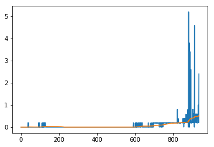
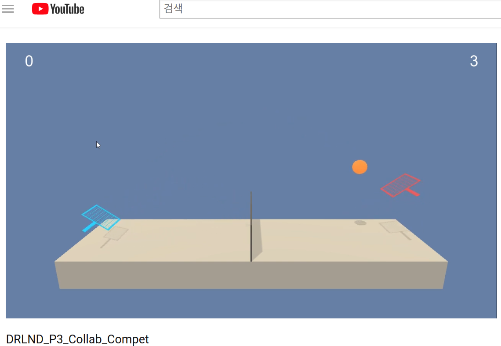

### Goal of project
two agents control rackets to bounce a ball over a net. If an agent hits the ball over the net, it receives a reward of +0.1. If an agent lets a ball hit the ground or hits the ball out of bounds, it receives a reward of -0.01. Thus, the goal of each agent is to keep the ball in play.

The environment is considered solved, when the average (over 100 episodes) of those scores is at least +0.5.

### Learning Algorithm
I use DDPG learning algorithm. DDPG is policy gradient actor-critic algorithm. it is off-policy and model-free. 
This is based on my [second project](https://github.com/studian/DRLND_P2_Continuous_Control). Main key points of DDPG are as follows
* Replay Buffer
* soft target update
* Batch Normalization
* add noise for explore

#### Actor
* bn1 : nn.BatchNorm1d(state_size)
* fc1 : nn.Linear(state_size, fc_units)
* activation : nn.functional.relu
* bn2 : nn.BatchNorm1d(fc_units)
* fc2 : nn.Linear(fc_units, fc2_units)
* activation : nn.functional.relu
* bn3 : nn.BatchNorm1d(fc2_units)
* fc3 : nn.Linear(fc2_units, action_size)
* activation : torch.tanh
#### Critic
* bn1 : nn.BatchNorm1d(state_size)
* fcs1 : nn.Linear(state_size, fcs1_units)
* activation : nn.functional.leaky_relu
* fc2 : nn.Linear(fcs1_units+action_size, fc2_units)
* activation : nn.functional.leaky_relu
* fc3 : nn.Linear(fc2_units, 1)

#### Hyper parameters
I modify some parameters. Experiments have shown that the size of the buffer and batch size have the greatest effect on the score.
Because input features are pretty simple, I also make my network complexity lower than before project

Parameter | Value
--- | ---
BUFFER_SIZE | int(1e5)
BATCH_SIZE | 256
GAMMA | 0.99  
TAU | 1e-3
LR_ACTOR | 1e-3
LR_CRITIC | 1e-3
WEIGHT_DECAY | 0
LEARNING_REPEAT | 20
LEARNING_STEP | 10

### Plot of Rewards

blue line represents max score at each epoch

orange line represents average (over 100 episodes) score

### Result video

### Future Work
The way i see it, bad experiences in the buffer was the problem. if batch size and buffer size is big, there is a bigger probability of bringing bad experiences than good experiences. For avoid this problem, i want to apply prioritized replay buffer.
